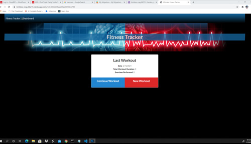

# Workout Tracker

## Description:

This application allows you to add and track workouts you have completed. Then you can continue adding excercises to a workout or start a new workout. Results can be viewed in stat graphs that are auto generated onto the stats html page.

---

> ## Table of Contents

- [Installation](#installation)
- [Usage](#usage)
- [Contributing](#contributing)
- [Tests](#tests)
- [Questions](#questions)

## Installation:

To install necessary dependencies run the following command:

> npm i

## Usage Information:

App is deployed to Heroku and uses cloud based Mongo DB Atlas. Full functionality can be demoed by following the provided link or clicking on the sample screenshot.

> </img>

## Contributing Information:

Nothing at this time.

## Tests:

To run tests, run the following command:

> n/a

## Questions:

---

> Creator Github account: [Kasey Raymond](https://api.github.com/users/KcRaymond)

> Email Creator: [kaseyleigh1978@gmail.com](mailto:)
